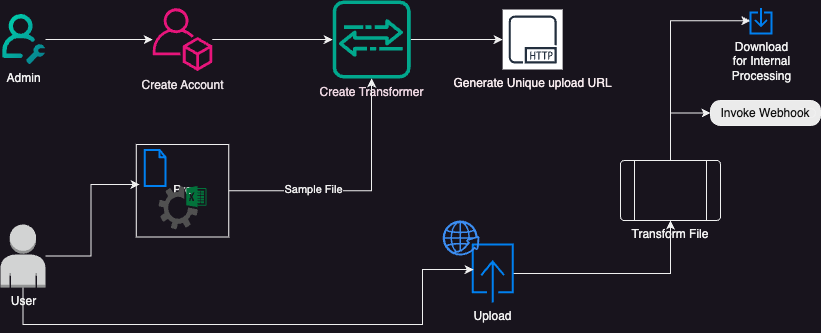
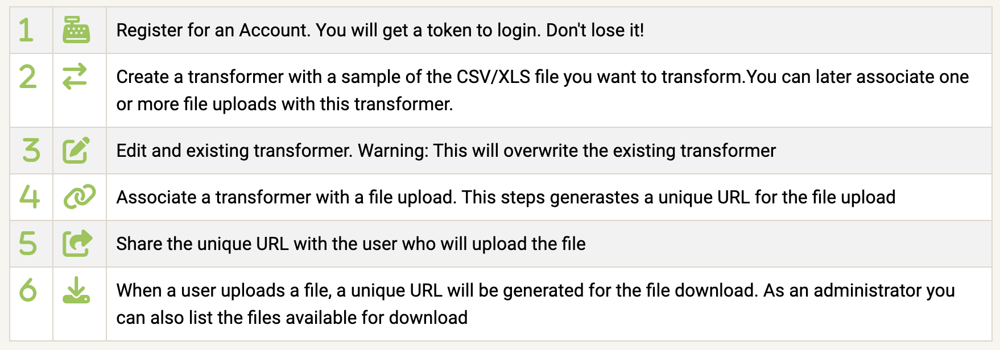

# Data Onboarding - transformer builder
## Sample, transform, map and simplify you data exchanges

Enable your customers and partners to upload CSV/XLS files and transform them to match your internal data schemas. The platform provides the infrastructure and components to generate data transformers and unique URLs for users to upload their data. 

Questions: [Ask Here](https://github.com/marcelonyc/xformer-builder/labels/question)

Live Demo: [Here](https://marcelonyc.pythonanywhere.com/)

## Features

- Upload CSV/XLS file: Users can easily upload their desired CSV/XLS file through the user interface.
- Column transformers: The project allows users to create transformers for each column using the ACE code editor.
- Restricted Python: The data transformer utilizes restricted Python to ensure secure and controlled data manipulation.
- Share a unique URL to upload/download files
- Trigger Webhook when a file is processed

## Getting Started

To get started with Xformer Builder, follow these steps:

1. Clone the repository: `git clone https://github.com/marcelonyc/xformer-builder`
2. Run setup.sh 
    - Requires Python > 3.10 
3. In one terminal run: `start-dev-dataplane.sh`
4. In another terminal run: `start-dev-controlplane.sh`
5. Access the application through your web browser at `http://localhost:8050`

Try it in the demo environment: [Demo](https://marcelonyc.pythonanywhere.com)

Suggestions for deployment architecture: [Here](ArchitectureSuggestions.md)

## Create a transformer

1. Upload CSV/XLS file: Click on "Upload Sample CSV/XLS file" and select the desired CSV/XLS file from your local machine.
2. Create transformers: Use the ACE code editor to create transformers for each column. Ensure that the code adheres to the restricted Python guidelines.
    - Use `data` as the variable containing the source data.
    - Use the dictionary `columns[]` to get values from other columns
    - Examples:
        - `data / 1000`
        - `data.split("-")`
        - `data * columns['other_data']`
3. Test transformations: Once the transformers are created, click on the "Test" button to execute the transformations.
    - The result displays on the column's row. You need to [expand](#expand-row-to-see-transformation-resutls) it.
    - Any errors will display in the column's row
4. When you are finished, Name the transformer
5. Test all the transformers from the navigation bar
6. Save transformers
    - The output goes to the console

The transformer is saved into multiple lists. Right now is just a print to the console. The actual code is base64 encoded.

## Application Configuration
To customize the application configuration, review the [CONFIG.INI](docs/CONFIG.md) document

## Contributing

Contributions are welcome! If you would like to contribute to Xformer Builder, please follow these guidelines:

1. Fork the repository.
2. Create a new branch for your feature or bug fix.
3. Make your changes and commit them with descriptive messages.
4. Push your changes to your forked repository.
5. Submit a pull request to the main repository.

## Screenshots

Here are some screenshots of the Xformer Builder application:

---

---
### Expand row to see transformation resutls

## Technologies and tools in this project

Build a data transformer using restricted Python with a Web UI using [Dash](https://dash.plotly.com/). The transformer is designed to manipulate data in columns from a CSV/XLS file. The project provides a user interface (UI) that allows users to upload the CSV/XLS file and create transformers for each column using the [ACE code editor](http://ace.c9.io/).

## License

This project is licensed under the MIT License. See the [LICENSE](LICENSE) file for more information.