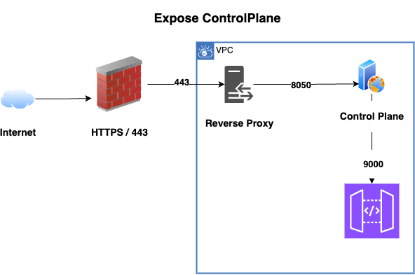

# Deployment Architecture Ideas



## Firewall

The firewall restrics access to specific ports. Cloud vendors offer security groups to associate with services running in your vpc.

You need to, at least, forward 443 to 8050 where your ControlPlane service is running.

## Reverse Proxy

Use a reverse proxy to forward traffic to specific urls for the services. The reverse proxy also serves as your https endpoint where your SSL certificate resides. Get familiar with [NGINX](https://nginx.org/en/docs/) to understand the configuration.

## NGINX Example I
In this example I provide a file that would go into nginx /etc/nginx/servers directory. The nginx.conf file contains `include servers/*.conf`

### Forward all calls to the Controlplane

controlplane.conf

```json
server {
    listen 443 ssl;
    server_name dataplane.somedomain.com;
    proxy_intercept_errors on;

    location / {
        proxy_pass          http://controlplane.mydomain.com:8050;
        client_max_body_size 100m;
        proxy_set_header    Host               $host;
        proxy_set_header    X-Real-IP          $remote_addr;
        proxy_set_header    X-Forwarded-For    $proxy_add_x_forwarded_for;
        proxy_set_header    X-Forwarded-Host   $host;
        proxy_set_header    X-Forwarded-Server $host;
        proxy_set_header    X-Forwarded-Port   $server_port;
        proxy_set_header    X-Forwarded-Proto  $scheme;
        proxy_set_header    Authorization  $http_authorization;
    }
}
```

